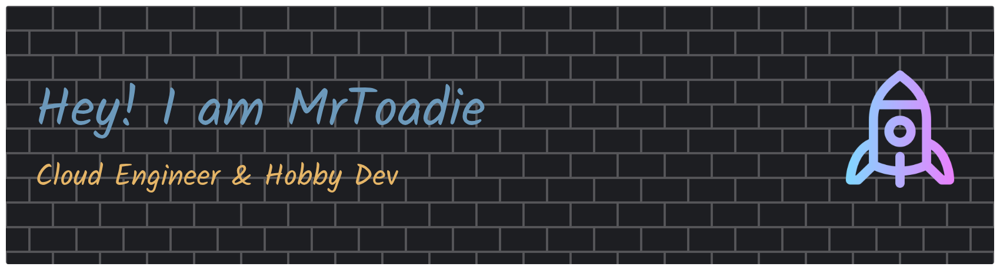

# Hello, World!
Hey! I'm Toadie, welcome to my GitHub page. I love open source and Linux. 

#### Main Linux Distributions
 

#### Interessets & Skills
   

    

## Repositorys
### [Ansible Playbook Examples](https://github.com/mrtoadie/ansible-playbooks)
Some examples of ready to go - ansible playbooks
### [dotfiles](https://github.com/mrtoadie/dotfiles)
Some of my Linux dotfiles for inspiration and use if you like

## Stats
Why not?

 
